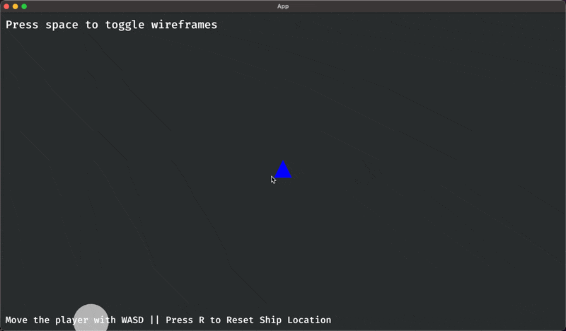

# Asteroids Rust

A feature-rich Asteroids game implementation using the Bevy game engine written in Rust.

<div align="center">
  
</div>

## Features

- **Realistic Physics**: Space-like ship movement with thrust-based acceleration and linear dampening
- **Shooting System**: Timer-based weapon mechanics with bullet collision detection
- **Asteroid Field**: Dynamic asteroid spawning and destruction with size-based particle effects
- **Particle Effects**: Engine thrust particles and explosion effects on asteroid destruction
- **Screen Wrapping**: Seamless movement across screen boundaries for both ship and asteroids
- **Wireframe Toggle**: Switch between filled and wireframe rendering modes
- **ECS Architecture**: Built using Bevy's Entity Component System for modular design

## Controls

- **WASD**: Move the player ship (W for thrust, A/D for rotation)
- **Space**: Shoot bullets
- **Tab**: Toggle wireframe rendering mode

## Building and Running

### Development Build
```bash
cargo run
```

### Optimized Release Build
```bash
cargo run --release
```

### Build Only
```bash
cargo build --verbose
```

### Run Tests
```bash
cargo test --verbose
```

## Architecture

This game follows a modular ECS (Entity Component System) architecture with the following modules:

- **Physics Module**: Handles movement, rotation, collision detection, and screen wrapping
- **Player Module**: Manages player ship spawning and components
- **Weapons Module**: Shooting mechanics with cooldown timers
- **Asteroids Module**: Asteroid spawning, collision, and destruction systems
- **Particles Module**: Visual effects for explosions and engine thrust
- **UI Module**: Text rendering and wireframe toggle functionality

## Dependencies

- **Bevy 0.14.2**: Game engine providing ECS architecture, rendering, and input systems
- **Avian2D 0.1.2**: 2D physics engine for collision detection and rigid body simulation
- **Rand**: Random number generation for particle effects and asteroid spawning
- **Tracing**: Logging and telemetry for debugging